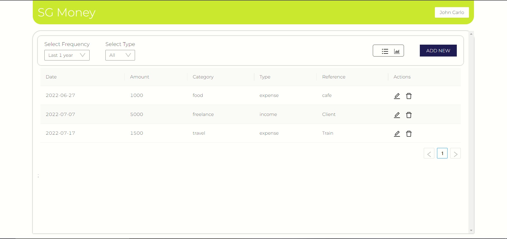
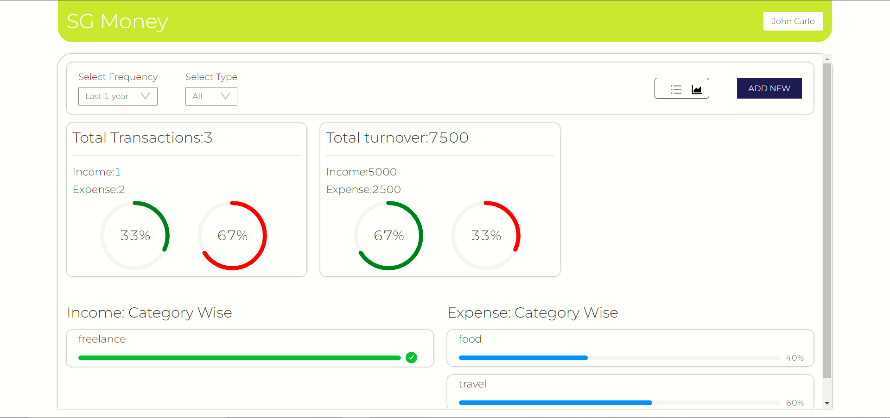

  

  

> The project is hosted online through Heroku - [Check it out](https://expense-tracker-11-21.herokuapp.com/login)

   

A user-organised expense/income tracking system that lets you log-in using the registered credentials, view/manage/update/delete your expenses and income, categorising them with corresponding tags through `CRUD` operations using axios API.

The application's backend is supported through a self-designed system hosted remotely on `MongoDB Atlas`, while the complete project is deployed online through `Heroku`.
  

## Features
 - Users can register and login using their EMail IDs and passwords set while signing up.
 - The landing page and each subsequent route features a modern UI designed through `CSS/SCSS and JS`.
 - Exploits `AXIOS API` supported through MongoDB Atlas, managed by `NodeJS`.
 - The website is integrated with `ExpressJS` as its templating engine, providing the users with multiple routes to Frequency, Type, Analytic View etc.
 - Enabled comparision between various income and expenses using chart and line analysis.
 - Facilitates the user to view their expenses/income categorywise for any time interval.

 

  

